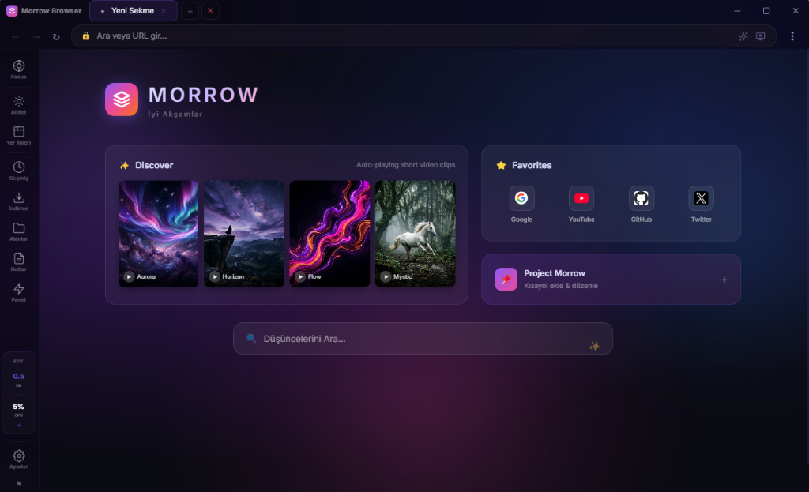
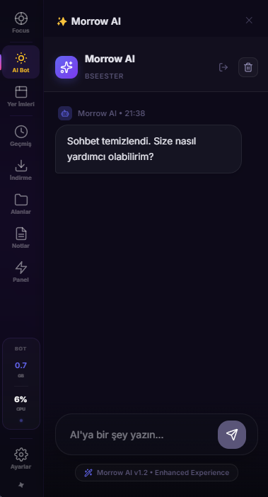
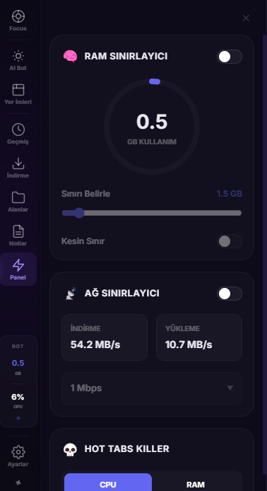

# Morrow Browser 🚀 (v1.4.1)

**Morrow Browser**, Electron, React ve TypeScript ile geliştirilmiş; hız, modern estetik (**Glassmorphism**) ve üst düzey performans optimizasyonu odaklı yeni nesil bir masaüstü internet tarayıcısıdır.

---

## 📸 Görünüm (Screenshots)

<p align="center">
  
</p>

<p align="center">
  
  
</p>

---

## ✨ Öne Çıkan Özellikler

- 🏎️ **Morrow Engine Pro:** Turbo Şarj modu, Derin Bellek Temizliği ve Site Bazlı Optimizasyon ile en hızlı Chromium deneyimi.
- 📡 **Native Network Limiter:** Yerleşik oturum emülasyonu ile %100 istikrarlı internet hızı kısıtlama (v1.4.0 Yeniliği).
- 🛰️ **Otomatik Sessiz Güncelleme:** Yeni sürümleri arka planda indirip kuran, tek tıkla güncelleme sistemi (v1.4.1 Yeniliği).
- 🗂️ **Gelişmiş Çalışma Alanları (Workspaces):** Sekmeleri iş ve kişisel hayatına göre ayır, her alan için bağımsız yer imlerine sahip ol.
- 🎨 **Premium Glassmorphism:** Derin blur efektleri, Lucide ikon setleri ve özelleştirilebilir "GX" tarzı temalar.
- 🛡️ **Gömülü AdBlock & Güvenlik:** Reklamları ağ katmanında engelleyen ve tracker'ları temizleyen dahili koruma sistemi.
- ⚡ **Kaynak Yönetimi:** Kullanıcı tanımlı RAM ve Ağ (Network) sınırlayıcıları ile sistem kaynaklarını sen kontrol et.

## 🛠️ Kurulum ve Geliştirme

Projeyi yerelde çalıştırmak için:

1. Bağımlılıkları kurun:
   ```bash
   npm install
   ```

2. Geliştirme modunu (Dev) başlatın:
   ```bash
   npm run dev
   ```

## 📦 Paketleme (Production / Setup)

Uygulamayı paketlemek için:

```bash
# Windows
npm run package:win

# macOS
npm run package:mac
```

---

## 🔧 Sürüm Notları: v1.4.1
- **Otomatik Güncelleme:** GitHub API tabanlı sessiz indirme ve kurulum altyapısı.
- **TopBar Progress Bar:** Güncelleme ilerlemesini gösteren canlı görsel bar.
- **EBUSY Fix:** Windows dosya sistemi çakışmaları giderildi.

### 🚀 1. Morrow Engine Pro Geliştirmeleri
- **Native Ağ Sınırlayıcı:** Debugger bağımlılığı kaldırıldı, yerleşik Electron emülasyonu ile daha düşük gecikme ve tam istikrar sağlandı.
- **Turbo Şarj Modu:** Aktif sekmeye CPU/GPU önceliği vererek takılmaların önüne geçer.

### 🎨 2. Arayüz ve Tasarım Dilinin Yenilenmesi
- **Mac Uyumluluğu:** macOS platformunda başlık ve logo sağ tarafa taşınarak sistem arayüzüyle tam uyum sağlandı.
- **Modern Ayarlar Sayfası:** Tüm ayarlar sayfası Lucide ikonları ve premium cam tasarımıyla baştan yazıldı.
- **Lucide İkon Seti:** Tüm navigasyon sistemine modern vektör ikonlar yerleştirildi.

### 🛡️ 3. Performans ve Stabilite
- **Hard RAM Limit:** Sistem belleği kritik seviyeye ulaştığında arka plan sekmelerini agresif bir şekilde uyutur.
- **Idle State Management:** Bilgisayar boştayken otomatik kaynak temizliği yapar.

---
Morrow Browser ile geleceğin web deneyimine hoş geldin! 🌈
